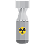

<!--
*** Thanks for checking out the Best-README-Template. If you have a suggestion
*** that would make this better, please fork the repo and create a pull request
*** or simply open an issue with the tag "enhancement".
*** Thanks again! Now go create something AMAZING! :D
***
***
***
*** To avoid retyping too much info. Do a search and replace for the following:
*** martinivnv, word-rush, twitter_handle, martinivnv2002@gmail.com, Word Rush, project_description
-->


<!-- PROJECT SHIELDS -->
<!--
*** I'm using markdown "reference style" links for readability.
*** Reference links are enclosed in brackets [ ] instead of parentheses ( ).
*** See the bottom of this document for the declaration of the reference variables
*** for contributors-url, forks-url, etc. This is an optional, concise syntax you may use.
*** https://www.markdownguide.org/basic-syntax/#reference-style-links
-->


<!-- PROJECT LOGO -->
<br />
<p align="center">
  <a href="https://github.com/martinivnv/word-rush">
    
  </a>

  <h3 align="center">Word Rush</h3>

  <p align="center">
    Push your typing skills to the limit as you save the city from falling nukes!
    <br />
    <a href="https://github.com/martinivnv/word-rush"><strong>Explore the docs »</strong></a>
    <br />
    <br />
    <a href="http://martinivnv.github.io/word-rush">View Demo</a>
    ·
    <a href="https://github.com/martinivnv/word-rush/issues">Report Bug</a>
    ·
    <a href="https://github.com/martinivnv/word-rush/issues">Request Feature</a>
  </p>
</p>


<!-- TABLE OF CONTENTS -->
<details open="open">
  <summary><h2 style="display: inline-block">Table of Contents</h2></summary>
  <ol>
    <li>
      <a href="#about-the-project">About The Project</a>
      <ul>
        <li><a href="#built-with">Built With</a></li>
      </ul>
    </li>
    <li>
      <a href="#getting-started">Getting Started</a>
      <ul>
        <li><a href="#prerequisites">Prerequisites</a></li>
        <li><a href="#installation">Installation</a></li>
      </ul>
    </li>
    <li><a href="#usage">Usage</a></li>
    <li><a href="#roadmap">Roadmap</a></li>
    <li><a href="#contributing">Contributing</a></li>
    <li><a href="#license">License</a></li>
    <li><a href="#contact">Contact</a></li>
    <li><a href="#acknowledgements">Acknowledgements</a></li>
  </ol>
</details>


<!-- ABOUT THE PROJECT -->
## About The Project

Push your typing skills to the limit as you save the city from falling nukes. <a href="http://martinivnv.github.io/word-rush">Click here to play!</a>
This is the very first project I ever created using JavaScript, written in December 2018. Going in, I knew absolutely nothing about JS, HTML, or CSS. This is reflected in the minimalist design of the game. I wrote it mostly by looking at how other in browser games were written and following the patterns and examples I saw to create something original that fit my vision. Although I did not fully know what objects were at the time, I incorporated them very effectively here to fit the needs of the project. I also did a very thorough job commenting the code, making it easy to follow.
An improvement I would make would be write the code utilizing more of the OOP conventions that I know now to make the code more readable and easier to edit. I would also create a more interesting and complex layout to the website using my present knowledge of CSS and HTML. 

<!-- GETTING STARTED -->
## Getting Started

To get a local copy up and running follow these simple steps.

### Installation

Clone the repo
   ```sh
   git clone https://github.com/martinivnv/word-rush.git
   ```

<!-- USAGE EXAMPLES -->
## Usage

<a href="http://martinivnv.github.io/word-rush">Play the game here!</a>


<!-- ROADMAP -->
## Roadmap

See the [open issues](https://github.com/martinivnv/word-rush/issues) for a list of proposed features (and known issues).


<!-- CONTRIBUTING -->
## Contributing

Contributions are what make the open source community such an amazing place to be learn, inspire, and create. Any contributions you make are **greatly appreciated**.

1. Fork the Project
2. Create your Feature Branch (`git checkout -b feature/AmazingFeature`)
3. Commit your Changes (`git commit -m 'Add some AmazingFeature'`)
4. Push to the Branch (`git push origin feature/AmazingFeature`)
5. Open a Pull Request


<!-- LICENSE -->
## License

Distributed under the MIT License.

<!-- CONTACT -->
## Contact

Martin Ivanov - martinivnv2002@gmail.com

Project Link: [https://github.com/martinivnv/word-rush](https://github.com/martinivnv/word-rush)


<!-- MARKDOWN LINKS & IMAGES -->
<!-- https://www.markdownguide.org/basic-syntax/#reference-style-links -->
[contributors-shield]: https://img.shields.io/github/contributors/martinivnv/repo.svg?style=for-the-badge
[contributors-url]: https://github.com/martinivnv/repo/graphs/contributors
[forks-shield]: https://img.shields.io/github/forks/martinivnv/repo.svg?style=for-the-badge
[forks-url]: https://github.com/martinivnv/repo/network/members
[stars-shield]: https://img.shields.io/github/stars/martinivnv/repo.svg?style=for-the-badge
[stars-url]: https://github.com/martinivnv/repo/stargazers
[issues-shield]: https://img.shields.io/github/issues/martinivnv/repo.svg?style=for-the-badge
[issues-url]: https://github.com/martinivnv/repo/issues
[license-shield]: https://img.shields.io/github/license/martinivnv/repo.svg?style=for-the-badge
[license-url]: https://github.com/martinivnv/repo/blob/master/LICENSE.txt
[linkedin-shield]: https://img.shields.io/badge/-LinkedIn-black.svg?style=for-the-badge&logo=linkedin&colorB=555
[linkedin-url]: https://linkedin.com/in/martinivnv
